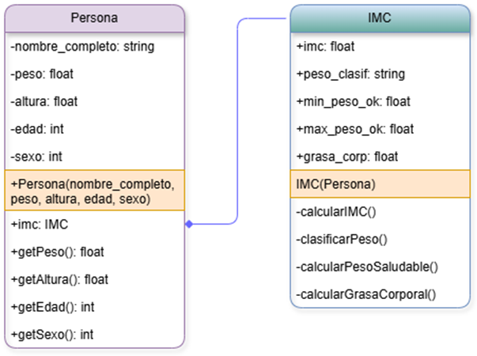

# Taller 1

## 1. Enunciado

Desarrollar un programa que calcule el `Índice de Masa Corporal (IMC)` y determine la clasificación de peso de una `persona`. A partir del IMC obtenido, el sistema también calculará el rango de peso saludable y la grasa corporal estimada.
Para ello, se deberá crear la clase `Persona`, que almacenará las propiedades esenciales de un individuo, incluyendo su nombre completo, peso, altura, edad y sexo `(1 para hombres y 0 para mujeres)`.
Asimismo, se implementará la clase `IMC`, la cual contará con métodos para calcular el IMC, la clasificación de peso, el rango de peso saludable (mínimo y máximo) y la grasa corporal estimada.

## 2. Diagrama UML de abstracción

Se crearon dos clases `Persona` y `IMC`. Al crear el objeto `Persona`, se crea el objeto `IMC`, con ello, se puede acceder directamente a los atributos de `IMC` de `Persona`, pues se calculan al construirse `Persona`.

## 3. Análisis de complejidad espacial

- Análisis de la Clase `IMC`
  - Métodos.
    1. `calcularIMC()` → 4 bytes (float).
    2. `clasificarPeso()` → X_1 bytes (string).
    3. `calcularPesoSaludable()` → 0 bytes (void).
    4. `calcularGrasaSaludable()` → 4 bytes (float).
  - Atributos.
    1. `imc` → 4 bytes (float).
    2. `peso_clasif` → X_2 bytes (float).
    3. `min_peso_ok` → 4 bytes (float).
    4. `max_peso_ok` → 4 bytes (float).
    5. `grasa_corp` → 4 bytes (float).
  - Ecuación de complejidad espacial.

    4(2) + X_1 + 4(4) + X_2 = X_1 + X_2 + 8 + 16
    = X_1 + X_2 + 24
- Análisis de la Clase `Persona`
  - Métodos.
    1. `getPeso()` → 4 bytes (float).
    2. `getAltura()` → Y_1 bytes (float).
    3. `getEdad()` → 4 bytes (int).
    4. `getSexo()` → 4 bytes (int).
  - Atributos.
    1. `imc` → X_1 + X_2 + 24 bytes (IMC).
    2. `nombre_completo` → Y_2 bytes (string).
    3. `peso` → 4 bytes (float).
    4. `edad` → 4 bytes (int).
    5. `sexo` → 4 bytes (int).
  - Ecuación de complejidad espacial.

    4(3) + Y_1 + X_1 + X_2 + 24 + Y_2 + 4(3) = Y_1 + Y_2 + X_1 + X_2 + 12 + 12 + 24
    = Y_1 + Y_2 + X_1 + X_2 + 48
- Análisis del `main()`

Como hay dos objetos `Persona`, y su complejidad espacial es `Y1 + Y2 + X_1 + X_2 + 48` entonces:

2(Y1 + Y2 + X_1 + X_2 + 48)
